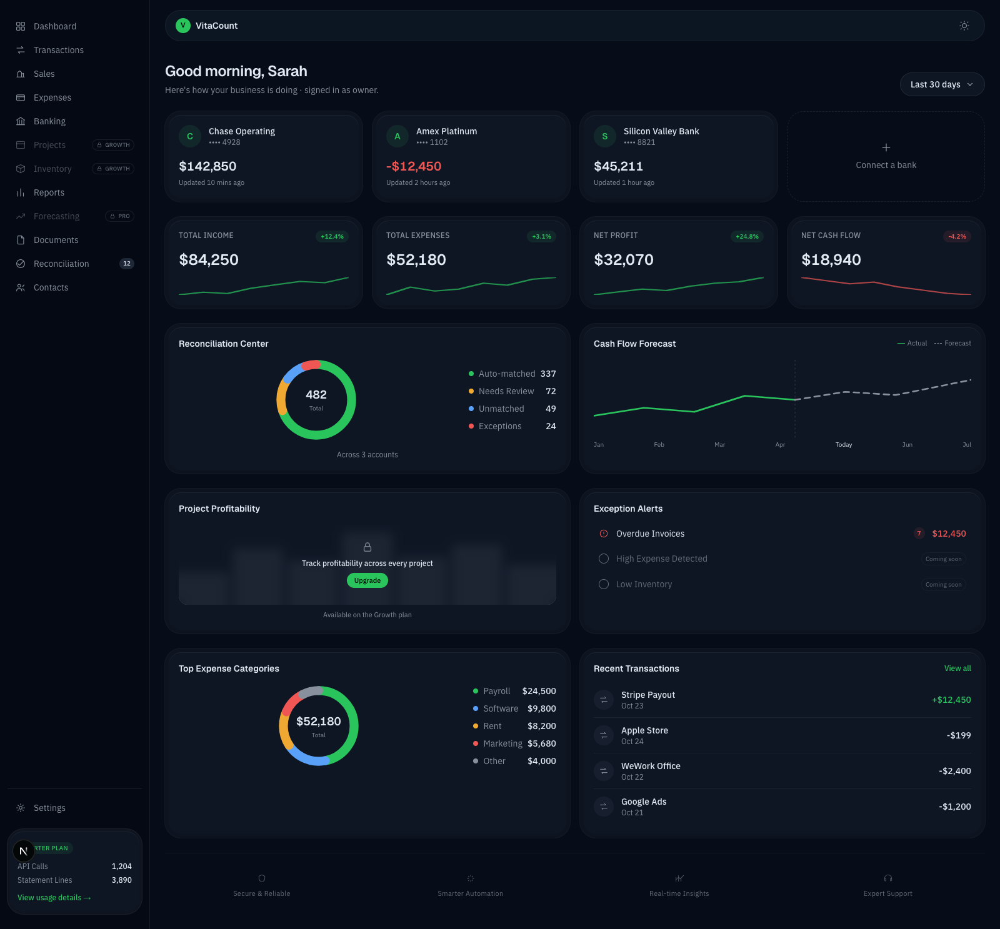
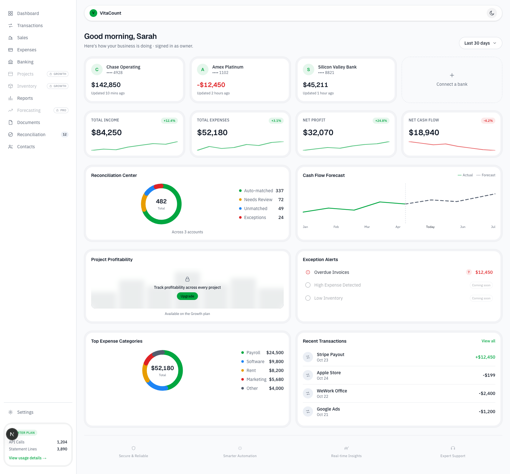

# VitaCount

**The financial operating system for US small businesses.**

Not "another QuickBooks" — VitaCount unifies accounting, banking reconciliation, invoicing, and an AI financial operator on one architectural core: the **Financial Graph**, where every operational event (an invoice, a bank line, a bill) resolves deterministically into GL postings. Zero-jargon UX on the surface (Money In / Money Out / Net Cash Flow), ledger-grade double-entry accuracy underneath, exposed to accountants in a dedicated CPA Mode.

<p align="center">
  
</p>

<details>
<summary>Light theme</summary>
<p align="center">
  
</p>
</details>

## Status

Early build, in progress against the milestone sequence in [build-playbook.md](./build-playbook.md). Currently shipped:

- ✅ **Auth & multi-tenancy** — Supabase Auth, workspaces, roles, RLS, team invites
- ✅ **Financial core** — chart of accounts, journal entries, a Postgres trigger that structurally enforces every entry balances, a pure-function posting engine
- ✅ **CPA Mode (minimal)** — chart of accounts view, journal entry list + form
- ✅ **Design system + Dashboard UI** — full dark/light theme, sidebar, top nav, and the Owner Mode dashboard (KPIs, bank accounts, reconciliation, cash flow forecast, exception alerts) — currently on illustrative sample data pending live queries
- ⏳ **Next up:** Contacts + Accounts Receivable (invoices, payments, Stripe Checkout)

Full running history of every build session, decisions made, and what's deferred: [CONTEXT_LOG.md](./CONTEXT_LOG.md).

## Tech stack

| Layer | Choice |
|---|---|
| Frontend | Next.js (App Router) + Tailwind v4 + shadcn/ui, on Vercel |
| Backend | Supabase Postgres — the ledger itself, not a cache — via PostgREST + Postgres functions for business logic |
| Auth & multi-tenancy | Supabase Auth + Postgres Row Level Security as the tenant boundary |
| Async jobs | pgmq + pg_cron + Edge Functions |
| AI | Claude API (tool-calling agents, vision-based document extraction) |
| Banking | Plaid |
| Payments | Stripe |

Full rationale for every choice: [project.md](./project.md) Part 1.

## Repo layout

```
apps/web                Next.js app (App Router)
supabase/migrations      SQL migrations, one per module
supabase/functions       Edge Functions
packages/tool-registry   Shared tool defs (agents + MCP server)
packages/posting-engine  Pure functions: business event -> journal lines
packages/ui              Shared shadcn/ui components
docs/                    Reference screenshots
```

## Local development

```bash
pnpm install
pnpm dev
```

Next.js only reads env files from its own project root, so real values go in `apps/web/.env.local` (copy `apps/web/.env.example` as a starting point — the root `.env.example` is kept in sync as the canonical list). Never commit any `.env.local`.

## Documentation

| Doc | What it's for |
|---|---|
| [project.md](./project.md) | Source of truth — full architecture, data model, and agentic layer spec |
| [build-playbook.md](./build-playbook.md) | Build sequence — one Claude Code session per milestone |
| [dashboard-ui-spec.md](./dashboard-ui-spec.md) | Every dashboard widget mapped to its exact data source |
| [CONTEXT_LOG.md](./CONTEXT_LOG.md) | Running log of what's been built and key decisions |
